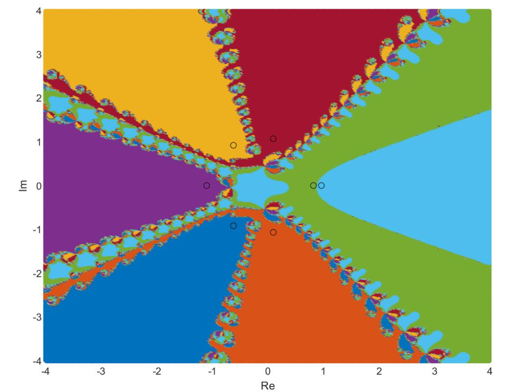
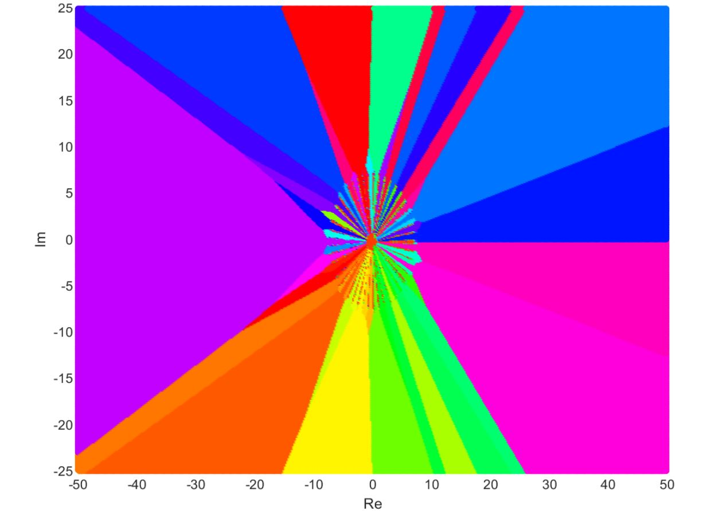
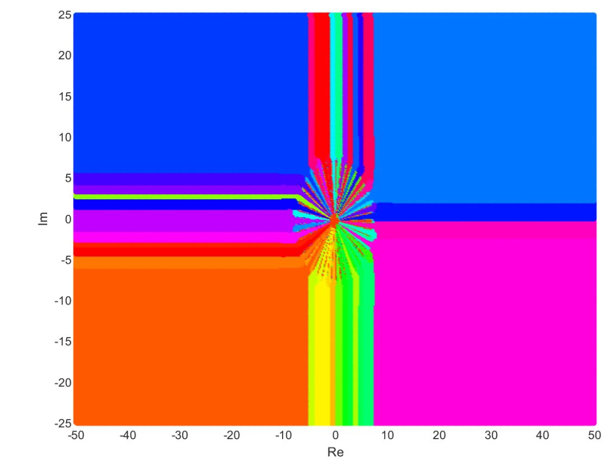

# CUDA Newton Iteration

Visualizing the convergence of Newton's iteration using CUDA to asynchronously perform the iteration

The plots (located in plots) are color coded based on which root of a polynomial the initial guess converged to be closest to

For example:



The iteration was performed on initial guesses evenly spaced over the complex plane. Yellow values mean that the initial guesses at those points converged to be closest to the yellow root (circled with a black outline). A CUDA kernel in [newton.cu](src/newton.cu) performs the iteration asynchronously for each initial guess.

## Running the Kernel

```bash
make # compile
make run<testName> # run iteration
make runBigTest # example use
```

`testName` can be one of:

| Name | Description |
|--|--|
| bigTest| order 7 polynomial |
| bigTest2 | order 12 |
| bigTest3 | order 30 |

## Creating the Visualizations

The visualizations are created in MATLAB. To view them, open the project in MATLAB, cd into scripts, and run:

```matlab
main <testName> [step]
```

`testName` is defined same as above

`step` is an optional parameter that allows us to step through the iteration.

*Note*: Values are color coded by default using L2 norm to define which root is closest to the point the initial guess converged to. Append L1 to `testName` to do so using the L1 norm, ex.:

```matlab
main bigTest3L1
```

bigTest3 using L2 norm:




Using L1 norm:



Amusingly, using the L1 norm basically just makes everything more square.
