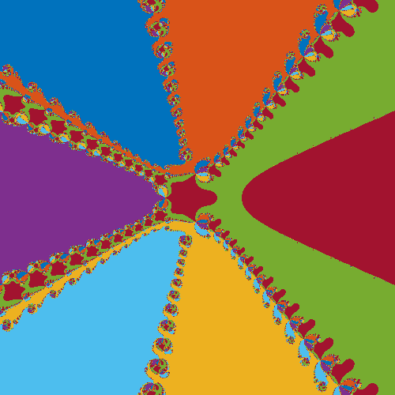

# CUDA Newton Iteration

Visualizing the convergence of Newton's iteration using CUDA to asynchronously perform the iteration

***Note***: This project was my final project for CMDA 4984: SS Scientific Computing at Scale. I've been working on the project since then, but what I submitted for that project is in the `old` branch.

Newton's method is used to find the roots of polynomials using an iterative sequences that (usually) converges to those roots. In this project, the iteration is performed on initial guesses evenly spaced all over the complex (Real and Imaginary) plane. Then, the values those initial guesses converge to are color-coded based on which root they converged to. For example, initial guesses that converge to the first root we find may be yellow, guesses that converge to the second root we find may be red, and so on. These are known as [Newton's Fractals](https://en.wikipedia.org/wiki/Newton_fractal).

For example:



A CUDA kernel in [src/newton.cu](src/newton.cu) performs the iteration asynchronously for each initial guess.

## Running the Code

Example use:

```bash
# compile
make

# run code
./bin/newton <testName> [NRe=300] NIm=300] [ReSpacing=3] [ImSpacing=3] [L1=false] [step=false]
```

*Note*: The values after = can be set by you, 300, 3, false, etc. are just the defaults

`testName` can be one of:

| Name          | Description                                        |
|--             |--                                                  |
| bigTest       | a given order 7 polynomial                         |
| bigTest2      | a given order 12 polynomial                        |
| anything else | you will be prompted to specify a polynomial (WIP) |

All of the other parameters are optional

*Note*: If you use bigTest or bigTest2, ReSpacing and ImSpacing will already be set

| Parameter | Description                                                |
|--         | --                                                         |
| NRe       | Number of real initial guess to run iteration on           |
| NIm       | Number of imaginary guesses                                |
| ReSpacing | if 4, the real initial guesses will be spaced from -4 to 4 |
| ImSpacing | same as above but for the imaginary values                 |
| L1        | set to true if you want to use L1 norm to measure distance |
| step      | set to true to output a png for each step                  |

For example:

```bash
./bin/newton bigTest L1=true step=false
```
This will output a png in [plots](plots)

## Step parameter

If step is set to true, the above command will output 50 pngs, one for each step of the iteration.

You can then stitch them into an mp4 (and clean up all the pngs) using:

```bash
make movie name=testName
```

i.e., if you ran:

```bash
./bin/newton bigTest step=true
```

Then stitch into a movie with

```bash
make movie name=bigTest
```

This will output bigTest.mp4 in `plots`

Example movie: [bigTest.mp4](plots/bigTest.mp4)

## Dependencies

| Dependency                  | Command to install on Ubuntu             |
|--                           |--                                        |
| Libpng                      | sudo apt-get install libpng-dev          |
| CUDA and a cuda-capable GPU | sudo apt-get install nvidia-cuda-toolkit |
| ffmpeg (makes the movies)   | sudo apt-get install ffmpeg              |
